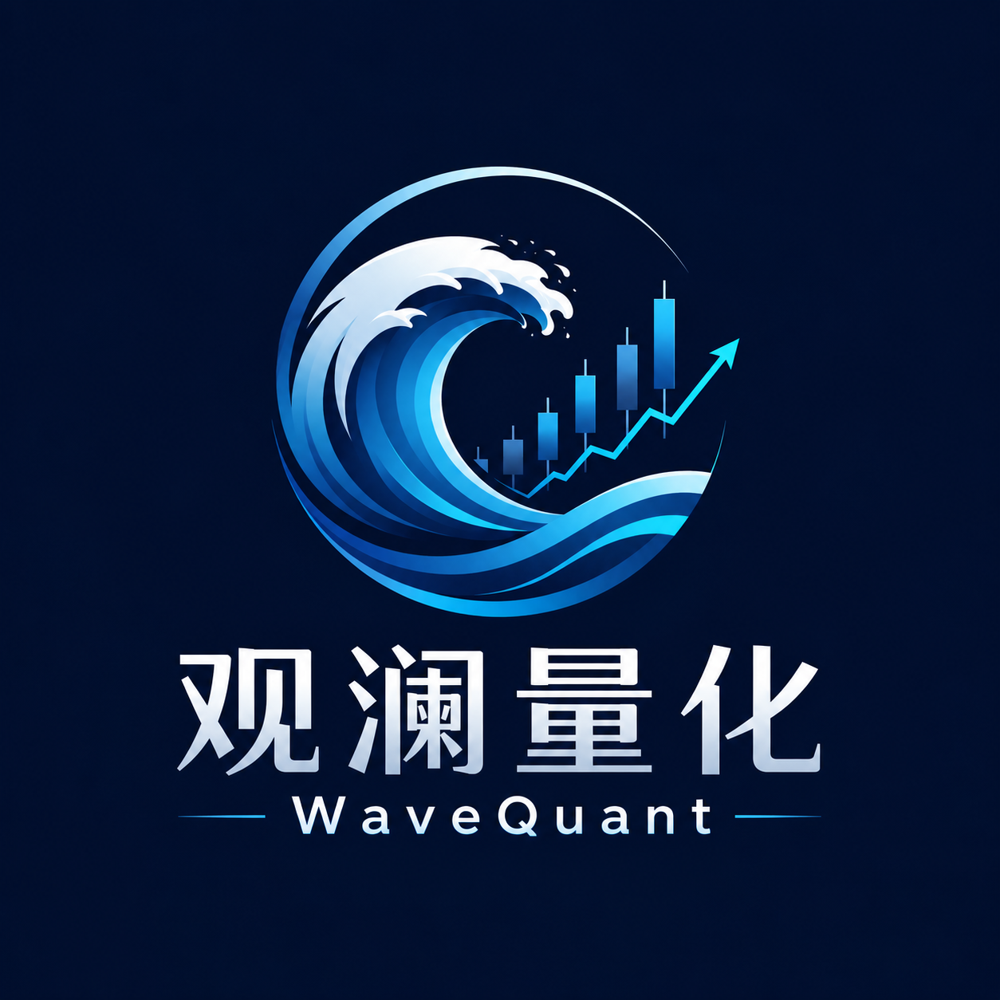

<div align="center">



# Wave Quant · 观澜量化

**A full-stack quant trading dashboard on OKX Demo Trading**
Live market terminal · Strategy bot · Execution layer · Risk engine · Backtesting · PnL analytics

**语言 / Language**: [中文](README.md) · English


</div>

An end-to-end loop of *signal → order → fill → position/PnL → risk*.

> ⚠️ **Demo Trading only.** The app connects exclusively to OKX Demo Trading (`flag = '1'`). Live trading is **hard-disabled in code** (`backend/app/core/security.py::enforce_demo_flag`) and cannot be enabled by configuration. This project is for learning and portfolio purposes and is **not investment advice**.

Setup steps 👉 **[STARTUP.en.md](STARTUP.en.md)**.

Evolved from the official [okx-sample-market-maker](https://github.com/okxapi/okx-sample-market-maker); the original market-making sample is kept under `okx_market_maker/` as a reusable library (original docs in `docs/LEGACY_README.md`).

---

## Screenshots

<!-- Drop screenshots into docs/screenshots/ with the filenames below; a screen-recording GIF goes to demo.gif -->

<div align="center">


</div>

| Dashboard | Trading terminal |
| :---: | :---: |
|  |  |
| **Strategy & PnL** | **Risk engine** |
|  |  |
| **Backtesting** | **Login** |
|  |  |

---

## Features

**Real-time trading terminal**
- Order book, candlestick chart, recent trades, order-entry panel — streamed over the public WebSocket
- Limit / market / post-only / IOC / FOK, plus conditional, OCO and trigger orders
- Price/size auto-rounded to each instrument's tick/lot/min before sending

**Strategy bot (single instance, background thread)**
- **Market-making**: two-sided post-only quoting with anti-churn (no re-quote unless the mid moves or a fill drops the order count)
- **16+ directional strategies**: MA cross / RSI / Bollinger / MACD / Donchian / Turtle / Grid / Momentum / Mean-reversion / DCA … — the same signals power both backtest and live
- **Event-driven loop**: a fill on the private WS wakes the bot to re-evaluate immediately instead of waiting out the timer

**Execution layer (multiple order styles)**
- Optional **taker / maker entry** for signal strategies (a resting maker order escalates to market on timeout)
- **Auto TP/SL**: on entry, a reduce-only OCO take-profit / stop-loss is placed off the average entry and cancelled on flat
- **TWAP slicing**: large rebalances fill over several cycles via a per-child-order size cap

**Risk engine**
- Pre-trade checks + runtime monitoring: net position / exposure / daily loss / drawdown / order & cancel rate / consecutive losses
- One-click Kill Switch (cancel + close), tiered breach actions (alert / pause / cancel / stop)

**PnL analytics & backtesting**
- Realized PnL / win rate / profit factor / fees / volume aggregated per instrument from the local fills stream
- Multi-strategy, multi-instrument backtests over OKX candles, with persisted history

**Accounts**
- Admin / member roles; every write operation is gated on both front and back end
- A **separate admin console** (port 5911) for managing members

**Reliability**
- Startup auto-reconcile (pulls in-flight orders/fills so a restart isn't blank)
- Private WebSocket idle keepalive + reconnect

---

## Tech stack

| Layer | Tech | Role |
| --- | --- | --- |
| **User dashboard** | React 18 · TypeScript · Vite · Ant Design 5 · ECharts | Trading terminal UI, charts, live data (port 5910) |
| **Admin console** | React 18 · TypeScript · Vite · Ant Design 5 | Standalone member management, admin-only (port 5911) |
| **Backend** | Python 3.10+ · FastAPI · SQLAlchemy 2.0 · Pydantic v2 | REST + WebSocket services, business logic, auth |
| **Market/Trade** | python-okx · websockets | OKX Demo Trading REST + public/private WebSocket |
| **Database** | MySQL 8 | Users, orders, fills, configs, backtests, logs |

> Auth is implemented with the standard library only (PBKDF2 hashing + HMAC-SHA256 self-contained token) — no extra dependencies.

---

## Architecture

```
   ┌──────────────────────┐   ┌──────────────────────┐
   │  User dashboard (5910)│   │   Admin console (5911)│
   │ React+TS+Antd+ECharts │   │  React+TS+Antd members │
   └───────────┬──────────┘   └───────────┬──────────┘
       REST /api │   WS /api/ws │ (market/orders/fills/positions/bot/logs)
   ┌────────────▼──────────────▼─────────────────────┐
   │              Backend (FastAPI)                    │
   │   api  ──►  services  ──►  repositories  ──► models│
   │                                                   │
   │   Resident tasks:                                 │
   │    • public market WS coroutine  (market_ws)      │
   │    • private order/position/account WS            │
   │      (private_ws → live_state)                    │
   │    • strategy / market-making bot (bot_manager)   │
   │    • WebSocket broadcast hub     (ws_manager)     │
   │    • demo-only safety lock       (core/security)  │
   └────────────┬──────────────────────┬───────────────┘
                │                       │ python-okx (flag=1)
        ┌───────▼──────┐      ┌─────────▼──────────┐
        │   MySQL      │      │  OKX Demo Trading   │
        │  (11 tables) │      │ REST + public/priv. │
        └──────────────┘      └────────────────────┘
```

**The event-driven loop**: OKX's private WS streams orders / fills / positions / account into `private_ws`, which persists them to the DB and an in-memory snapshot (`live_state`) and wakes the bot on every fill; the bot adjusts quotes / entries / TP-SL and sends orders back to OKX — closing the loop. REST polling remains a fallback when the WS is unavailable.

---

## Project structure

```
backend/            FastAPI backend
  app/
    api/            routes (account/orders/positions/strategy/risk/backtest/pnl/…)
    services/       business logic (bot_manager/strategies/order_service/risk_service/
                    private_ws/live_state/pnl_service/…)
    repositories/   database CRUD
    models/         SQLAlchemy ORM (11 tables)
    schemas/        Pydantic models
    core/           config, database, auth, demo-only safety lock
  scripts/          idempotent column-migration scripts
frontend/           user trading dashboard (port 5910)
admin-frontend/     admin member-management console (port 5911)
okx_market_maker/   official market-making sample (reused as a library)
deploy/mysql/       database init SQL
docs/               legacy docs & screenshots
```

---

## Security notes

- **Live trading disabled**: `OKX_FLAG` accepts only `'1'` (demo); passing `'0'` throws on startup.
- **No secrets in the repo**: OKX API Key/Secret/Passphrase are read only from `backend/.env` (environment variables); no real keys exist in the code or repository, and `.env` is git-ignored.
- **Change defaults before production**: `SECRET_KEY` (token signing), the default admin password and the MySQL password are local-dev defaults only — set your own in `.env`.

---

## Acknowledgements

- Official sample: [okxapi/okx-sample-market-maker](https://github.com/okxapi/okx-sample-market-maker)
